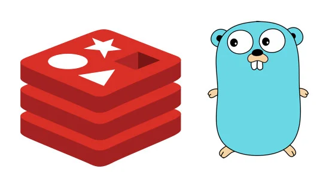
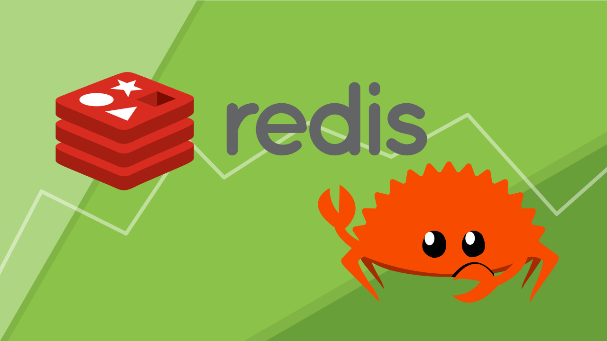

# Redis Clone

<p float="left">


</p>

A Redis clone database implemented in both **Go** and **Rust**. This project aims to replicate the core functionalities of Redis, providing a simple and efficient in-memory data structure store.

<p float="left">


</p>

## Features

- **Key-Value Storage**: Store data as key-value pairs.
- **Data Types**: Support for various data types such as strings, lists, sets, and hashes.
- **Persistence**: Basic data persistence with snapshotting (RDB).
- **Simple Command Interface**: A command-line interface to interact with the database.
- **High Performance**: Designed for low latency and high throughput.

## Technologies

- **Go**: The Go implementation is designed for performance and ease of use, utilizing goroutines for concurrent processing.
- **Rust**: The Rust implementation emphasizes safety and speed, leveraging the language's ownership model.

## Getting Started

### Prerequisites

- [Go](https://golang.org/dl/) (for the Go implementation)
- [Rust](https://www.rust-lang.org/tools/install) (for the Rust implementation)

### Installation

Clone the repository:

```bash
git clone https://github.com/Ravikisha/Redis-Clone
cd Redis-Clone
```

### Running the Go Implementation

To run the Go implementation, navigate to the `go` directory:

```bash
cd go
go run server.go
```

### Running the Rust Implementation

To run the Rust implementation, navigate to the `rust` directory:

```bash
cd rust
cargo run
```

### Command-Line Interface

You can interact with the database through a simple command-line interface. The following commands are supported:

- `SET key value`: Set a key to hold the string value.
- `GET key`: Get the value of the key.
- `DEL key`: Delete a key.
- `EXISTS key`: Check if a key exists.

## Contributing

Contributions are welcome! Please read the [CONTRIBUTING.md](CONTRIBUTING.md) for details on our code of conduct, and the process for submitting pull requests.

## License

This project is licensed under the MIT License - see the [LICENSE](LICENSE) file for details.

## Acknowledgments

- [Redis](https://redis.io/) for the inspiration behind this project.